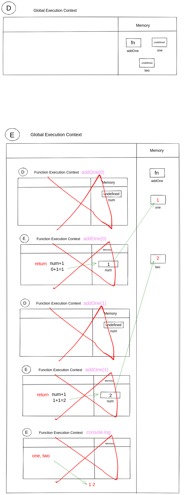
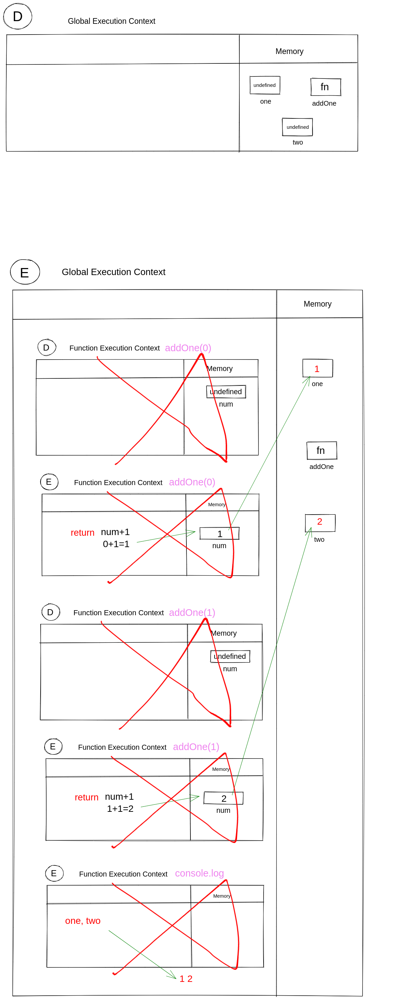
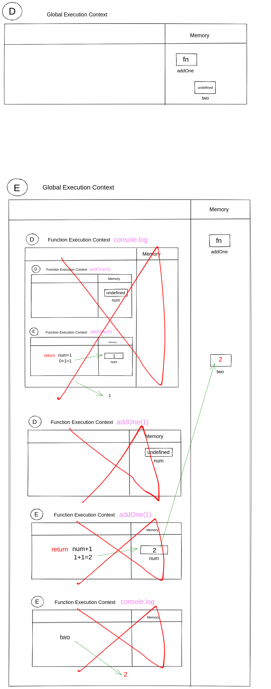
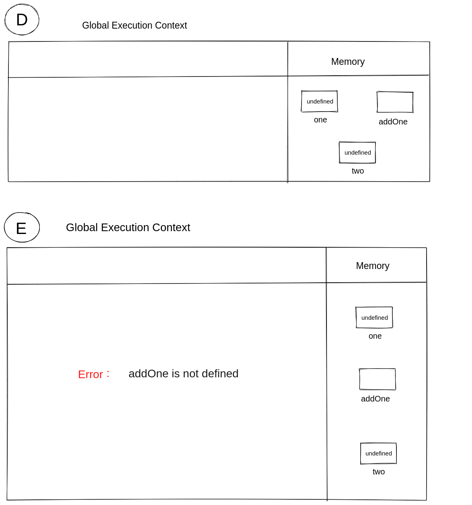
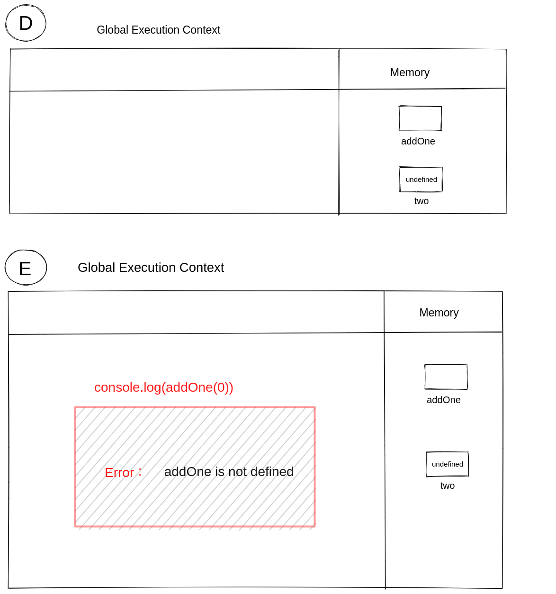

## Understanding Scope and the difference between var, let and const

Watch this video before doing the exercise: https://www.youtube.com/watch?v=XgSjoHgy3Rk

1. Guess the output:

```js
let firstName = 'Arya';
const lastName = 'Stark';
var knownAs = 'no one';

console.log(
  window.firstName,
  window.lastName,
  window.knownAs
);
//undefined,undefined,"no ome"
```

2. Guess the output:

```js
let firstName = 'Arya';
const lastName = 'Stark';
var knownAs = 'no one';

function fullName(a, b) {
  return a + b;
}

console.log(window.fullName(firstName, lastName));
//'AryaStark'
```

3. Make a Execution Context Diagram for the following JS and write the output.

```js
function addOne(num){
  return num + 1;
}
var one = addOne(0);
var two = addOne(1);
console.log(one, two);
//1 2
```


4. Make a Execution Context Diagram for the following JS and write the output.

```js
var one = addOne(0);
function addOne(num){
  return num + 1;
}
var two = addOne(1);
console.log(one, two);
//1 2
```

5. Make a Execution Context Diagram for the following JS and write the output.

```js
console.log(addOne(0));
function addOne(num){
  return num + 1;
}
var two = addOne(1);
console.log(two);
//1
//2
```


6. Make a Execution Context Diagram for the following JS and write the output.

```js
var one = addOne(0);
const addOne = (num) => {
  return num + 1;
};
var two = addOne(1);
console.log(two);
// ReferenceError: addOne is not defined
```


7. Make a Execution Context Diagram for the following JS and write the output.

```js
console.log(addOne(0));
const addOne = (num) => {
  return num + 1;
};
var two = addOne(1);
console.log(two);
// ReferenceError: addOne is not defined
```


8. What will be the output of the following

```js
function isAwesome() {
  var awesome;
  if (false) {
    awesome = true;
  }
  console.log(awesome);
}
isAwesome();
//undefined 
```
awesome is created using var keyword so it will be initialized with undefined and since if condition is false awesome will not update and undefined will consol-log.
9. What will be the output of the following

```js
function isAwesome() {
  let awesome;
  if (true) {
    awesome = true;
  }
  console.log(awesome);
}
isAwesome();
//true
```
since if condition is true so `awesome` will be  assigned the value true and hence output is true,

10. What will be the output of the following

```js 
function isAwesome() {
  let awesome;
  if (false) {
    awesome = true;
  }
  console.log(awesome);
}
isAwesome();
//undefined
```
although `awesome` is defined using let keyword but has not assigned any value so undefined will be assigned in execution mode.

11. What will be the output of the following

```js
let firstName = 'Arya';
const lastName = 'Stark';
var knownAs = 'no one';

function fullName(a, b) {
  return a + b;
}
const name = fullName(firstName, lastName);
console.log(name);
//AryaStark
```

12. Guess the output of the code below with a reason.

```js
function sayHello() {
  let name = 'Arya Stark';
}
sayHello();

console.log(name);
```
name is a global variable which is in the window object. So when you log, it goes and finds the global one, which's value is empty string ("") in your case.

13. Guess the output of the code below with a reason.

```js
if (true) {
  var name = 'Arya Stark';
}
console.log(name);
//Arya Stark
```
here `name` is created using var so it is not block scoped so we can access it from outside.

14. Guess the output of the code below with a reason.

```js
if (true) {
  let name = 'Arya Stark';
}
console.log(name);
//  ""  empty string
```
name is a global variable which is in the window object. So when you log, it goes and finds the global one, which's value is empty string ("") in your case.

15. Guess the output of the code below with a reason.

```js
for (var i = 0; i < 20; i++) {
  //
}
console.log(i);
//20;
//after for loop ends i is equal to 20;
```

16. Guess the output of the code below with a reason.

```js
for (let i = 0; i < 20; i++) {
  //
}
console.log(i);
//referenceError i is not defined
```
since let is block scoped so we can't access variable declared with let keyword from outside.


17. Guess the output and the reason behind that.

```js
function sample() {
  if (true) {
    var username = 'John Snow';
  }
  console.log(username);
}
sample();
//John Snow
```
var is not block scoped hence when function is called it get hoisted on the top out of its block therefor we can access the variable declared inside block from out of the block.

18. Guess the output and the reason behind that.

```js
function sample() {
  if (true) {
    let username = 'John Snow';
  }
  console.log(username);
}
sample();
// ReferenceError  username is not defined.
```
we can't access variable declared with let keyword outside of block as it is block scoped.


19. Guess the output and the reason behind that.

```js
function sample() {
  var username = 'Arya Stark';
  if (true) {
    var username = 'John Snow';
    console.log(username);
  }
  console.log(username, 'second');
}
sample();
// John Snow
// John Snow second

```
here using var we are redefining `username` as var is not block scoped so it will hoist on top out of the block. hence the `username` defined earlier will be redefined.

20. Guess the output and the reason behind that.

```js
function sample() {
  let username = 'Arya Stark';
  if (true) {
    let username = 'John Snow';
    console.log(username, 'first');
  }
  console.log(username, 'second');
}
sample();
// John Snow first
// Arya Stark second
```
here `username` is defined with let keyword and let create variable of block scope so we can't access it from outside hence inside function first local variable 

21. Guess the output and the reason behind that.

```js
function sample(...args) {
  for (let i = 0; i < args.length; i++) {
    let message = `Hello I am ${args[i]}`;
    console.log(message);
  }
}

sample('First', 'Second', 'Third');
// Hello I am First
// Hello I am Second
// Hello I am Third
```
here we are using rest operator which means we are creating array form arguments passed so we can access as much value as many we pass as arguments
22. Guess the output and the reason behind that.

```js
function sample(...args) {
  for (let i = 0; i < args.length; i++) {
    const message = `Hello I am ${args[i]}`;
    console.log(message);
  }
}

sample('First', 'Second', 'Third');
// Hello I am First
// Hello I am Second
// Hello I am Third
```
-here we are using rest operator which means we are creating array form arguments passed so we can access as much value as many we pass as arguments

-here although we are defining variable `message` with const keyword so its value should not change but here we are creating `message` variable whenever loop is running and assigning means we are not iterating the value of massage once assigned. we are creating variable each time.
23. Guess the output and the reason behind that.

```js
if (true) {
  const myFunc = function () {
    console.log(username, 'Second');
  };
  console.log(username, 'First');
  let username = 'Hello World!';
  myFunc();
}
// ReferenceError: Cannot access 'username' before initialization
```
here we are using `username` before assigning any value to `username`;

24. Guess the output and the reason behind that.

```js
function outer() {
  let movie = 'Mad Max: Fury Road';
  function inner() {
    console.log(
      `I love this movie called ${movie.toUpperCase()}`
    );
  }
  inner();
}

outer();
// I love this movie called MAD MAX: FURY ROAD
```
here we are calling uppercase method so it is returning `movie` value in uppercase. 

25. Guess the output and the reason behind that.

```js
function outer() {
  let movie = 'Mad Max: Fury Road';
  function inner() {
    let movie = 'Before Sunrise';
    console.log(
      `I love this movie called ${movie.toUpperCase()}`
    );
  }
  inner();
}

outer();
// I love this movie called BEFORE SUNRISE
```

26. Guess the output and the reason behind that.

```js
function outer() {
  let movie = 'Mad Max: Fury Road';
  function inner() {
    let movie = 'Before Sunrise';
    function extraInner() {
      let movie = 'Gone Girl';
      console.log(
        `I love this movie called ${movie.toUpperCase()}`
      );
    }
    extraInner();
  }
  inner();
}
outer();
// I love this movie called GONE GIRL
```

30. Using reduce find the final value when the initial value passed is `100`. You have to pass the output of one function into the input of next function in the array `allFunctions` starts with `addOne` ends with `half`.

```js
const addOne = (num) => {
  return num + 1;
};
const subTwo = (num) => {
  return num - 2;
};
const multiplyThree = (num) => {
  return num * 3;
};
const half = (num) => {
  return num / 2;
};

let allFunctions = [
  addOne,
  subTwo,
  multiplyThree,
  addOne,
  multiplyThree,
  half,
];

allFunctions.reduce((acc,cv)=> {
acc = cv(acc);
return acc},100)
// Answer is: 447
```
